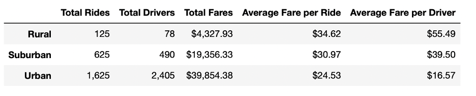
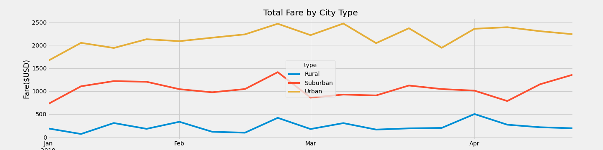

# PyBer_Analysis

## Overview
The purpose of this analysis is to show and compare the differences in ride-sharing data among different city types (rural, urban, and suburban).

## Results
### PyBer Data Summary
- 
- Looking at this overview of the data, we can see that urban cities have the highest number of total rides, the highest number of total drivers and fares, the lowest average fare per ride, and the lowest average fare per driver. 
- Rural cities, conversely, have the lowest number of total rides, the lowest number of total drivers and fares, the highest average fare per ride, and the highest average fare per driver. 

### Total Rides

- Urban cities make up 68.4% of total rides, suburban cities make up 26.3% of total rides, and rural cities make up 5.3% of total rides.

### Total Drivers

- Urban cities make up 80.9% of total drivers, suburban cities make up 16.5% of total drivers, and rural cities make up 2.6% of total drivers. 

### Total Fares

- Urban cities make up 62.7% of total fares, suburban cities make up 30.5% of total fares, and rural cities make up 6.8% of total fares. 

### Total Fare by City Type

## Summary
